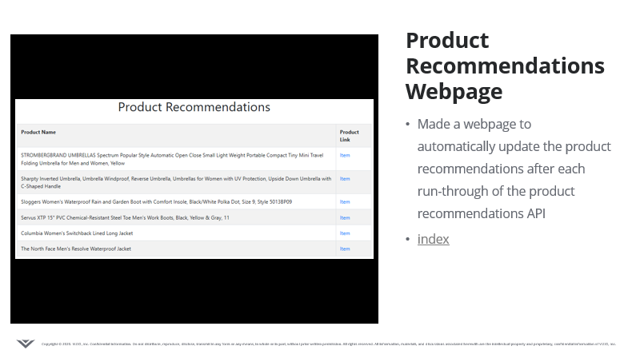

# Location Weather API and Product Recommendations

## Location Weather API Documentation:
https://app.swaggerhub.com/apis-docs/allston.fojas/DMA_Weather_API/1.0.0

## Steps for the Location Weather API:

1. Get recent NOAA Climate Data from the NOAA website to be able to automatically update the weather data twice a day
2. Merge the NOAA Station Observation Data with the NOAA Station Lat/Long Data
3. Read in DMA Data and Change Data Layout to a List of Dictionaries

4.1. Filter NOAA stations to get just US Locations and Find the Closest DMA for each Station

4.2. Calculate Haversine Distance to Find the Closest DMA for each Station

4.3. Convert the NOAA & DMA data from a Dictionary to a DataFrame

5. Get the Data of whether it is rainy/snowy for a particular DMA
6. Access API to Get the Data of whether it is rainy/snowy for a particular DMA

## Steps for the Product Recommendations:

1. Web scrape Amazon for products used in rainy or snowy weather
2. Perform Feature Engineering
- Remove all the NaN values
- Combine all the fields into a large string and put into new column called features
- Remove the stop words, or articles
- Compute count matrix
- Compute cosine similarity
3. Make product links as hyperlinks
4. Get product recommendations

## Presentation - Title and Demo Slides:

## GHCN Daily By Year Documentation
___https://www1.ncdc.noaa.gov/pub/data/ghcn/daily/by_year/___

___gchn-daily-by_year-format.rtf___

The following information serves as a definition of each field in one line of data covering one station-day. Each field described below is separated by a comma ( , ) and follows the order
presented in this document.

- ID = 11 character station identification code
- YEAR/MONTH/DAY = 8 character date in YYYYMMDD format (e.g. 19860529 = May 29, 1986)
- ELEMENT = 4 character indicator of element type 
- DATA VALUE = 5 character data value for ELEMENT 
- M-FLAG = 1 character Measurement Flag 
- Q-FLAG = 1 character Quality Flag 
- S-FLAG = 1 character Source Flag 
- OBS-TIME = 4-character time of observation in hour-minute format (i.e. 0700 =7:00 am)

See section III of the GHCN-Daily readme.txt file for an explanation of ELEMENT codes and their units as well as the M-FLAG, Q-FLAGS and S-FLAGS.

The OBS-TIME field is populated with the observation times contained in NOAA/NCDC’s Multinetwork Metadata System (MMS).  

## GHCN Daily Documentation
___https://www1.ncdc.noaa.gov/pub/data/ghcn/daily/readme.txt___

___Station ID:___

ID         is the station identification code.  Please see "ghcnd-stations.txt"
           for a complete list of stations and their metadata.
           
___Date:___
Year and Month

___Observation Type:___
ELEMENT    is the element type.   There are five core elements as well as a number
           of addition elements.  
	   
           The five core elements are:

           PRCP = Precipitation (tenths of mm)
           SNOW = Snowfall (mm)
           SNWD = Snow depth (mm)
           TMAX = Maximum temperature (tenths of degrees C)
           TMIN = Minimum temperature (tenths of degrees C)
           
           The other elements are located in the README linked above.

___Measurement Flag:___

MFLAG1     is the measurement flag for the first day of the month.  There are
           ten possible values:

           Blank = no measurement information applicable
           B     = precipitation total formed from two 12-hour totals
           D     = precipitation total formed from four six-hour totals
           H     = represents highest or lowest hourly temperature (TMAX or TMIN) 
                   or the average of hourly values (TAVG)
           K     = converted from knots 
           L     = temperature appears to be lagged with respect to reported
                   hour of observation 
           O     = converted from oktas 
           P     = identified as "missing presumed zero" in DSI 3200 and 3206
           T     = trace of precipitation, snowfall, or snow depth
           W     = converted from 16-point WBAN code (for wind direction)
           
___Quality Flag:___

QFLAG1     is the quality flag for the first day of the month.  There are 
           fourteen possible values:

           Blank = did not fail any quality assurance check
           D     = failed duplicate check
           G     = failed gap check
           I     = failed internal consistency check
           K     = failed streak/frequent-value check
           L     = failed check on length of multiday period 
           M     = failed megaconsistency check
           N     = failed naught check
           O     = failed climatological outlier check
           R     = failed lagged range check
           S     = failed spatial consistency check
           T     = failed temporal consistency check
           W     = temperature too warm for snow
           X     = failed bounds check
           Z     = flagged as a result of an official Datzilla 
                   investigation
                   
___Source Flag:___

SFLAG1     is the source flag for the first day of the month.  There are 
           thirty possible values (including blank, upper and 
           lower case letters):

           Blank = No source (i.e., data value missing)
           0     = U.S. Cooperative Summary of the Day (NCDC DSI-3200)
           6     = CDMP Cooperative Summary of the Day (NCDC DSI-3206)
           7     = U.S. Cooperative Summary of the Day -- Transmitted 
                   via WxCoder3 (NCDC DSI-3207)
           A     = U.S. Automated Surface Observing System (ASOS) 
                   real-time data (since January 1, 2006)
           a     = Australian data from the Australian Bureau of Meteorology
           B     = U.S. ASOS data for October 2000-December 2005 (NCDC 
                   DSI-3211)
           b     = Belarus update
           C     = Environment Canada
           D     = Short time delay US National Weather Service CF6 daily 
                   summaries provided by the High Plains Regional Climate
                   Center
           E     = European Climate Assessment and Dataset (Klein Tank 
                   et al., 2002)	   
           F     = U.S. Fort data 
           G     = Official Global Climate Observing System (GCOS) or 
                   other government-supplied data
           H     = High Plains Regional Climate Center real-time data
           I     = International collection (non U.S. data received through
                   personal contacts)
           K     = U.S. Cooperative Summary of the Day data digitized from
                   paper observer forms (from 2011 to present)
           M     = Monthly METAR Extract (additional ASOS data)
           m     = Data from the Mexican National Water Commission (Comision
                   National del Agua -- CONAGUA)
           N     = Community Collaborative Rain, Hail,and Snow (CoCoRaHS)
           Q     = Data from several African countries that had been 
                   "quarantined", that is, withheld from public release
                   until permission was granted from the respective 
                   meteorological services
           R     = NCEI Reference Network Database (Climate Reference Network
                   and Regional Climate Reference Network)
           r     = All-Russian Research Institute of Hydrometeorological 
                   Information-World Data Center
           S     = Global Summary of the Day (NCDC DSI-9618)
                   NOTE: "S" values are derived from hourly synoptic reports
                   exchanged on the Global Telecommunications System (GTS).
                   Daily values derived in this fashion may differ significantly
                   from "true" daily data, particularly for precipitation
                   (i.e., use with caution).
           s     = China Meteorological Administration/National Meteorological Information Center/
                   Climatic Data Center (http://cdc.cma.gov.cn)
           T     = SNOwpack TELemtry (SNOTEL) data obtained from the U.S. 
                   Department of Agriculture's Natural Resources Conservation Service
           U     = Remote Automatic Weather Station (RAWS) data obtained
                   from the Western Regional Climate Center	   
           u     = Ukraine update	   
           W     = WBAN/ASOS Summary of the Day from NCDC's Integrated 
                   Surface Data (ISD).  
           X     = U.S. First-Order Summary of the Day (NCDC DSI-3210)
           Z     = Datzilla official additions or replacements 
           z     = Uzbekistan update
	   
           When data are available for the same time from more than one source,
           the highest priority source is chosen according to the following
           priority order (from highest to lowest):
           Z,R,D,0,6,C,X,W,K,7,F,B,M,m,r,E,z,u,b,s,a,G,Q,I,A,N,T,U,H,S
